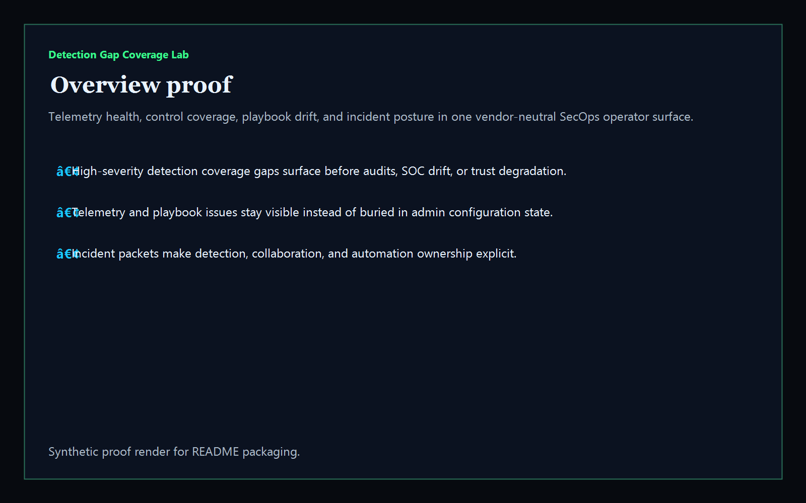
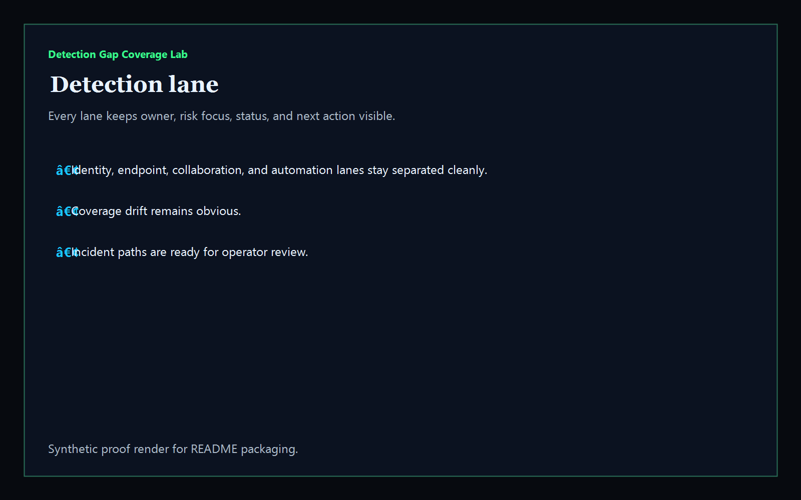
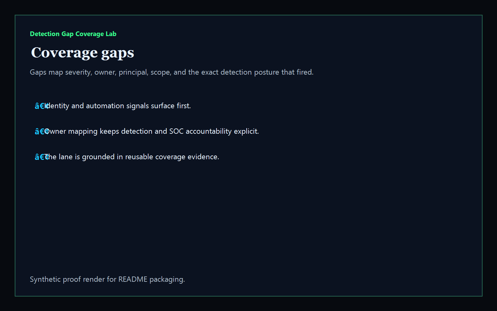
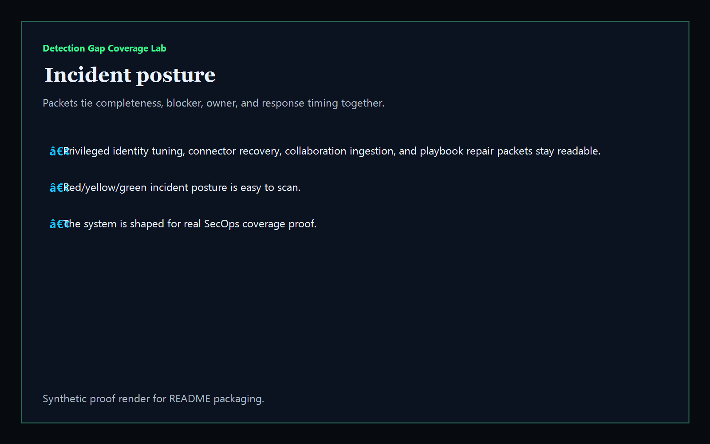

# detection-gap-coverage-lab

[](https://github.com/mizcausevic-dev/detection-gap-coverage-lab/actions/workflows/ci.yml)
[](./LICENSE)
[](https://github.com/mizcausevic-dev/detection-gap-coverage-lab/actions/workflows/pages.yml)

Operator control plane for vendor-neutral detection coverage, telemetry reach, control drift, incident automation gaps, and response sequencing.

## Why this exists

- Detection programs become dangerous when telemetry drift, disabled controls, and stale incidents stay trapped in raw admin state instead of one operator-readable surface.
- Identity, endpoint, collaboration, cloud, and incident-automation coverage need to stay visible together before audits, response drift, or trust posture slips.
- Recruiters looking for `SecOps / detection engineering / SIEM / XDR / SOC` proof should see a real coverage dashboard, not a keyword page.
- This repo turns detection posture data into a control plane for telemetry gaps, high-severity coverage findings, stale incidents, and operator packet sequencing.

## Why this matters (KG Embedded tie-back)

This repo demonstrates the vendor-neutral detection-coverage control-plane primitive for security operations: telemetry reach, control findings, automation posture, and incident packets in one operator surface. Kinetic Gain Embedded extends this pattern into productized in-app dashboards where SecOps, identity, endpoint, and collaboration teams need evidence-rich surfaces without exposing raw admin backends or credentials. See [kineticgain.com/embedded](https://kineticgain.com/embedded).

## What it shows

- `detection-lane` visibility for identity, endpoint, SaaS/collaboration, and automation coverage in one dashboard
- `coverage-gaps` detection for degraded surfaces, telemetry gaps, control drift, and stale incident posture
- incident packets for privileged access tuning, connector recovery, collaboration ingestion, and playbook repair
- offline-safe analysis of captured synthetic detection coverage snapshots
- recruiter-facing SecOps proof that complements Defender, Sentinel, Entra, Intune, M365 retention, AWS, and GCP lanes

## Routes

- `/`
- `/detection-lane`
- `/coverage-gaps`
- `/incident-posture`
- `/verification`
- `/docs`

## API

- `/api/dashboard/summary`
- `/api/detection-lane`
- `/api/coverage-gaps`
- `/api/incident-posture`
- `/api/verification`
- `/api/sample`

## Screenshots






## CLI

```powershell
npx detection-gap-coverage fixtures/detection-coverage.json `
    --format json|markdown|summary `
    --now 2026-05-30T00:00:00Z `
    --stale-detection-after-hours 48 `
    --fail-on-high `
    --out report.md
```

Input shape:

```json
{
  "surfaces": [ ... ],
  "gaps": [ ... ]
}
```

## Local Development

```powershell
cd detection-gap-coverage-lab
npm install
npm run dev
```

Open:
- [http://127.0.0.1:5520/](http://127.0.0.1:5520/)
- [http://127.0.0.1:5520/detection-lane](http://127.0.0.1:5520/detection-lane)
- [http://127.0.0.1:5520/coverage-gaps](http://127.0.0.1:5520/coverage-gaps)
- [http://127.0.0.1:5520/incident-posture](http://127.0.0.1:5520/incident-posture)
- [http://127.0.0.1:5520/verification](http://127.0.0.1:5520/verification)

## Validation

- `npm run lint`
- `npm run typecheck`
- `npm run coverage`
- `npm run build`
- `npm run demo`
- `npm run smoke`
- `npm run prerender`
- `npm run render:assets`

## Production status

| Aspect | Status |
|--------|--------|
| CI | Node 20 + 22 matrix — lint · typecheck · coverage · build · demo · smoke · prerender · `npm audit` |
| License | [AGPL-3.0-or-later](./LICENSE) |
| Deploy | Static prerender -> **https://coverage.kineticgain.com/** |
| Data posture | Synthetic sample data only; no live credentials, customer events, or production incidents |
| Portfolio | Part of the [Kinetic Gain Atlas](https://portfolio.kineticgain.com/) operator portfolio · apex: [kineticgain.com](https://kineticgain.com) |

## Docs

- [Kinetic Gain Embedded tie-back](./docs/KINETIC_GAIN_EMBEDDED.md)
- [Changelog](./CHANGELOG.md)

## Composes with

- [**`defender-exposure-ops-center`**](https://github.com/mizcausevic-dev/defender-exposure-ops-center) — Defender exposure posture
- [**`sentinel-detection-coverage-board`**](https://github.com/mizcausevic-dev/sentinel-detection-coverage-board) — Microsoft Sentinel detection posture
- [**`aws-guardduty-triage-board`**](https://github.com/mizcausevic-dev/aws-guardduty-triage-board) — AWS finding triage posture

Together they form a broader recruiter-facing security lane: exposure, telemetry coverage, incident automation, and detection engineering proof.

## Part of the Kinetic Gain Suite

Operator surface in the [Kinetic Gain Suite](https://suite.kineticgain.com/) — a portfolio of buyer-readable control planes spanning security posture, compliance evidence, data-platform governance, FinOps, and operator workflows. See the suite index for related surfaces. Apex: [kineticgain.com](https://kineticgain.com/).
